# ACA -- Programación Avanzada

# Sistema de Gestión de Biblioteca

------------------------------------------------------------------------

## PORTADA

**Corporación Unificada Nacional de Educación Superior CUN.**

**PROGRAMA: Programación Avanzada**

### ACA -- Programación Avanzada

### Sistema de Gestión de Biblioteca

**Presentado por:**
Kely Yohana Quilindo Hernandez

**Docente:**\
Veronica Castro

**Fecha:**\
zipaquira septiembre 2026

------------------------------------------------------------------------

# CONTRAPORTADA

**Sistema de Gestión de Biblioteca**

Proyecto desarrollado como evidencia del curso de **Programación
Avanzada**, aplicando Programación Orientada a Objetos, base de datos
relacional, arquitectura por capas, operaciones CRUD, validaciones,
manejo de excepciones y conexión con SQL Server.

**Estudiante(s):** Kely Yohana Quilindo Hernandez
**Programa:** Programación Avanzada
**Grupo:** 53304
**Docente:** Veronica Castro\
**Institución:** Corporación Unificada Nacional de Educación Superior CUN.
**Año:** 2026

------------------------------------------------------------------------

# TABLA DE CONTENIDO


1.  Introducción
2.  Objetivos
    -   2.1 Objetivo general
    -   2.2 Objetivos específicos
3.  Planteamiento del problema
4.  Análisis de requerimientos
5.  Casos de uso
6.  Diagrama de clases
7.  Modelo entidad-relación
8.  Diccionario de datos
9.  Arquitectura del sistema
10. Explicación de los módulos desarrollados
11. Capturas de pantalla del sistema
12. Pruebas de funcionamiento
13. Conclusiones
14. Recomendaciones
15. Referencias bibliográficas

------------------------------------------------------------------------

# 1. INTRODUCCIÓN


El presente documento detalla el desarrollo de un Sistema de Gestión de Biblioteca
en formato de escritorio, diseñado para automatizar la administración de libros, 
estudiantes y el control de préstamos en una institución educativa. La solución se 
construyó utilizando el lenguaje C# y el motor de bases de datos SQL Server, 
aplicando los principios de la Programación Orientada a Objetos (POO).

A lo largo del informe se exponen el planteamiento del problema, los requerimientos del software, 
los diagramas demodelado (clases, casos de uso y entidad-relación), el diccionario de datos y la arquitectura 
técnica del sistema, ofreciendo una visión integral del proyecto desarrollado.

------------------------------------------------------------------------

# 2. OBJETIVOS

## 2.1 Objetivo general

Desarrollar una aplicación de escritorio utilizando C# y SQL Server que permita
gestionar los procesos principales de una biblioteca mediante la aplicación de
Programación Orientada a Objetos y conexión a bases de datos.


## 2.2 Objetivos específicos

Para el correcto desarrollo e implementacion del sistema,se plantean las siguientes metas tecnicas y operativas:
- Aplicar los principios de Programación Orientada a Objetos.
- Diseñar una base de datos relacional.
- Implementar operaciones CRUD.
- Utilizar SQL Server como gestor de base de datos.
- Implementar arquitectura por capas.
- Validar información ingresada por el usuario.
- Manejar excepciones.
- Utilizar Git y GitHub como sistema de control de versiones.
- Documentar técnicamente el proyecto. 

------------------------------------------------------------------------

# 3. PLANTEAMIENTO DEL PROBLEMA

## 3.1 Descripción del problema

Una institución educativa desea automatizar el proceso de administración de su
biblioteca.
Actualmente toda la información relacionada con los libros, estudiantes,
préstamos y devoluciones se realiza manualmente, ocasionando pérdida de
información, errores en los registros y dificultad para consultar el estado de los
préstamos.
Para solucionar esta problemática se requiere desarrollar un sistema de escritorio
que permita administrar de forma organizada toda la información de la biblioteca.

## 3.2 Justificación

El desarrollo de este sistema permitirá organizar y facilitar la administración de
la biblioteca, reduciendo errores y pérdida de información. Además, permitirá controlar
de manera rápida y eficiente los libros, estudiantes, préstamos y devoluciones, mejorando
el manejo de la información y el servicio de la biblioteca.

## 3.3 Alcance

El sistema permitirá:

-   Gestionar libros.
-   Gestionar autores.
-   Gestionar categorías.
-   Gestionar usuarios.
-   Registrar préstamos.
-   Registrar devoluciones.
-   Consultar disponibilidad.
-   Consultar historial de préstamos.


------------------------------------------------------------------------

# 4. ANÁLISIS DE REQUERIMIENTOS

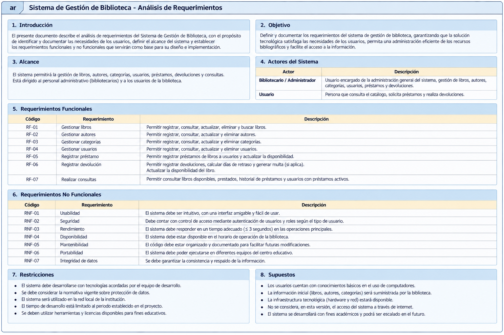

## 4.1 Descripción general

El Sistema de Gestión de Biblioteca permitirá administrar la información de libros,
autores, categorías y usuarios, además de controlar los procesos de préstamos, 
devoluciones y consultas de disponibilidad e historial.

## 4.2 Actores del sistema

  -----------------------------------------------------------------------
  Actor                               Descripción
  ----------------------------------- -----------------------------------
  Bibliotecario / Administrador       Se encarga de registrar y gestionar libros, autores,
                                      categorías y usuarios. También registra préstamos y
                                      devoluciones, consulta la disponibilidad de los libros
                                      y revisa el historial de préstamos.

 


## 4.3 Requerimientos funcionales

  -----------------------------------------------------------------------
  Código                  Requerimiento           Descripción
  ----------------------- ----------------------- -----------------------
  RF01                    Gestionar libros        Registrar, consultar,
                                                  actualizar, eliminar y
                                                  buscar libros.

  RF02                    Gestionar autores       Registrar, consultar,
                                                  actualizar y eliminar
                                                  autores.

  RF03                    Gestionar categorías    Registrar, consultar,
                                                  actualizar y eliminar
                                                  categorías.

  RF04                    Gestionar usuarios      Registrar, consultar,
                                                  actualizar y eliminar
                                                  usuarios.

  RF05                    Registrar préstamos     Registrar préstamos y
                                                  actualizar la
                                                  disponibilidad de los
                                                  libros.

  RF06                    Registrar devoluciones  Registrar devoluciones,
                                                  calcular retrasos y
                                                  multa cuando aplique.

  RF07                    Realizar consultas      Consultar libros
                                                  disponibles, libros
                                                  prestados, historial y
                                                  usuarios con préstamos
                                                  activos.


## 4.4 Requerimientos no funcionales

  -----------------------------------------------------------------------
  Código                  Requerimiento           Descripción
  ----------------------- ----------------------- -----------------------
  RNF01                   Usabilidad              La interfaz debe ser
                                                  clara, sencilla y fácil
                                                  de utilizar.

  RNF02                   Validación              El sistema debe validar
                                                  la información
                                                  ingresada por el
                                                  usuario.

  RNF03                   Mantenibilidad          El código debe estar
                                                  organizado y
                                                  documentado.

  RNF04                   Arquitectura            El sistema debe
                                                  utilizar una
                                                  arquitectura por capas.

  RNF05                   Manejo de excepciones   Las operaciones deben
                                                  manejar errores de
                                                  forma controlada.

  RNF06                   Integridad de datos     La información debe
                                                  mantenerse consistente
                                                  en la base de datos.

  RNF07                   Consultas               Las consultas a la base
                          parametrizadas          de datos deben utilizar
                                                  parámetros.

  
## 4.5 Reglas de negocio

### RN01 -- Código único del libro

No se permitirá registrar dos libros con el mismo código.

### RN02 -- Datos obligatorios

No se permitirá almacenar registros con campos obligatorios vacíos.

### RN03 -- Usuario existente

No se podrá registrar un préstamo para un usuario inexistente.

### RN04 -- Libro existente

No se podrá registrar un préstamo para un libro inexistente.

### RN05 -- Disponibilidad

No se podrá prestar un libro cuando no existan ejemplares disponibles.

### RN06 -- Actualización de disponibilidad

Al registrar un préstamo, la disponibilidad del libro deberá
actualizarse.

### RN07 -- Devolución

Al registrar una devolución, la disponibilidad deberá actualizarse
nuevamente.


------------------------------------------------------------------------

# 5. CASOS DE USO


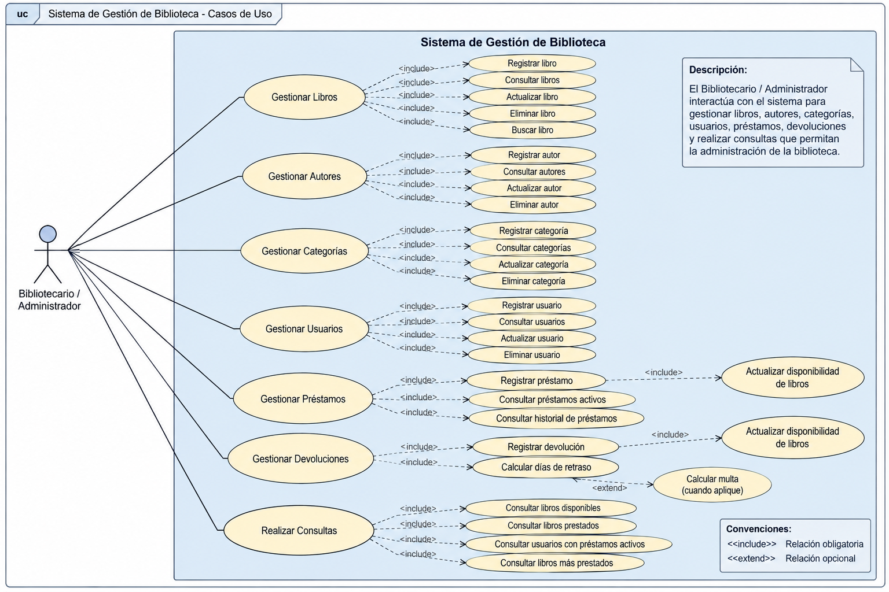

##  Descripción de casos de uso

### CU01 -- Gestionar libros

**Actor principal:** Bibliotecario / Administrador

**Descripción:** Permite registrar, consultar, actualizar, eliminar y
buscar libros.

**Precondiciones:** - El usuario debe tener acceso al sistema.

**Flujo principal:** 1. El actor ingresa al módulo de libros. 2. El
sistema muestra los libros registrados. 3. El actor selecciona la
operación que desea realizar. 4. El sistema procesa la solicitud. 5. El
sistema muestra el resultado.


------------------------------------------------------------------------

### CU02 -- Registrar préstamo

**Actor principal:** Bibliotecario / Administrador

**Descripción:** Permite registrar el préstamo de uno o varios libros a
un usuario.

**Precondiciones:** - El usuario debe existir. - El libro debe
existir. - Debe existir disponibilidad.

**Flujo principal:** 1. Seleccionar usuario. 2. Seleccionar libro. 3.
Verificar disponibilidad. 4. Registrar préstamo. 5. Actualizar
disponibilidad. 6. Mostrar confirmación.

**Flujos alternativos:** - Usuario inexistente. - Libro inexistente. -
Libro sin disponibilidad.
**Postcondiciones:** - El préstamo queda registrado. - La disponibilidad
del libro queda actualizada.

------------------------------------------------------------------------

### CU03 -- Registrar devolución

**Actor principal:** Bibliotecario / Administrador

**Descripción:** Permite registrar la devolución de un libro prestado.

**Precondiciones:** - Debe existir un préstamo activo.

**Flujo principal:** 1. Seleccionar el préstamo. 2. Registrar la
devolución. 3. Calcular días de retraso. 4. Calcular multa cuando
corresponda. 5. Actualizar disponibilidad. 6. Actualizar el estado del
préstamo. 7. Mostrar confirmación.


**Postcondiciones:** - La devolución queda registrada. - El libro vuelve
a estar disponible según corresponda.

------------------------------------------------------------------------

# 6. DIAGRAMA DE CLASES


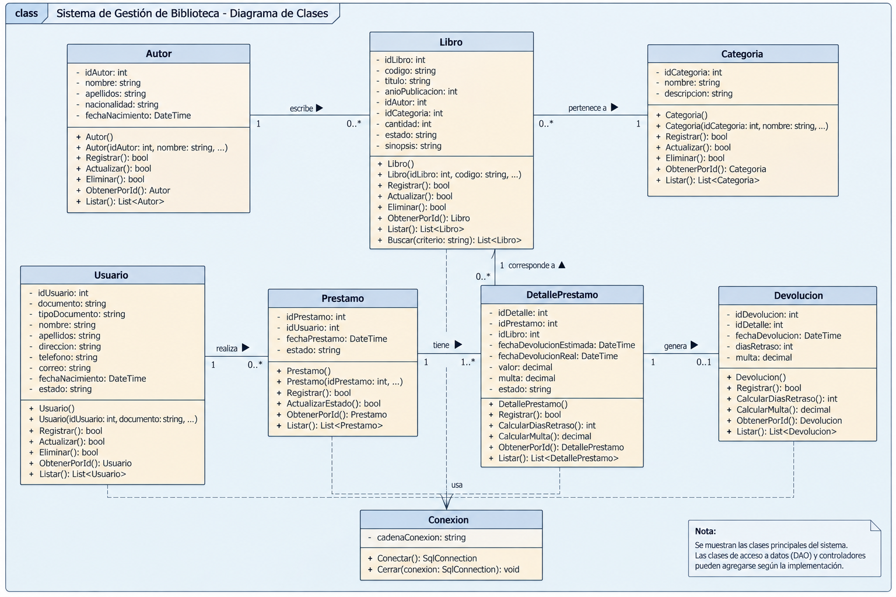

## Principales clases

  Clase             Responsabilidad
  ----------------- --------------------------------------------------------
  Libro             Representar y gestionar la información de los libros.
  Autor             Representar y gestionar los autores.
  Usuarios          Representar los usuarios de la biblioteca.
  Editoriales       Representar las editoriales de los libros.
  Prestamo          Gestionar la información de los préstamos.
  Reportes		    Generar informes sobre préstamos, devoluciones y disponibilidad.
 
## 6.4 Aplicación de POO


-  Clases: Se crearon clases para representar las entidades principales del sistema, como Libro, Autor, Categoría, Usuario y Préstamo.
-  Objetos: Se crean objetos a partir de las clases para trabajar con la información de cada libro, usuario, préstamo, entre otros.
-  Constructores: Se utilizan para inicializar los objetos con sus datos correspondientes.
-  Métodos: Permiten realizar acciones como registrar, actualizar, eliminar y consultar información.
-  Propiedades: Representan los datos de cada objeto, como el título de un libro, nombre del autor o información del usuario.
-  Encapsulamiento: Se utiliza para proteger los datos de las clases mediante propiedades y modificadores de acceso.
-  Colecciones: Se pueden utilizar colecciones para almacenar y manejar grupos de objetos, como listas de libros o usuarios.

------------------------------------------------------------------------

# 7. MODELO ENTIDAD-RELACIÓN

## 7.1 Descripción

El Modelo Entidad-Relación (MER) diseñado representa la estructura lógica
de los datos que soportan las operaciones de la biblioteca, asegurando la
integridad, consistencia y eliminación de redundancias mediante relaciones 
bien definidas.

## 7.2 Diagrama entidad-relación


## 7.3 Relaciones principales

A continuación se describen las relaciones e integridad referencial establecidas en el modelo de datos:

- *Un autor puede escribir muchos libros:* La tabla LIBROS recibe la clave foránea IdAutor para asociar la obra con su respectivo creador.
- *Una editorial puede publicar muchos libros:* Se establece una relación de uno a muchos ($1:N$) mediante la clave foránea IdEditorial en la tabla LIBROS.
- *Un usuario puede realizar muchos préstamos:* Cada transacción en la tabla PRESTAMOS se vincula con el lector usando la clave foránea IdUsuario.
- *Un préstamo corresponde a un libro específico:* La tabla PRESTAMOS almacena de forma directa el ISBN del libro que ha sido retirado.
------------------------------------------------------------------------

# 8. DICCIONARIO DE DATOS

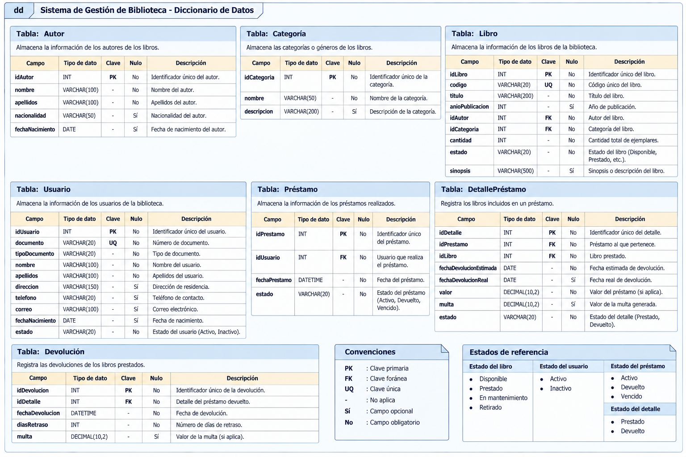


# 9. ARQUITECTURA DEL SISTEMA

## 9.1 Descripción general

El Sistema de Gestión de Biblioteca se desarrolla utilizando una
**arquitectura por capas**, con el propósito de separar las
responsabilidades del sistema y facilitar su mantenimiento, organización
y evolución.

La arquitectura está compuesta por:

1.  Capa de Presentación.
2.  Capa de Lógica de Negocio.
3.  Capa de Acceso a Datos.
4.  Capa de Base de Datos.

## 9.2 Diagrama de arquitectura


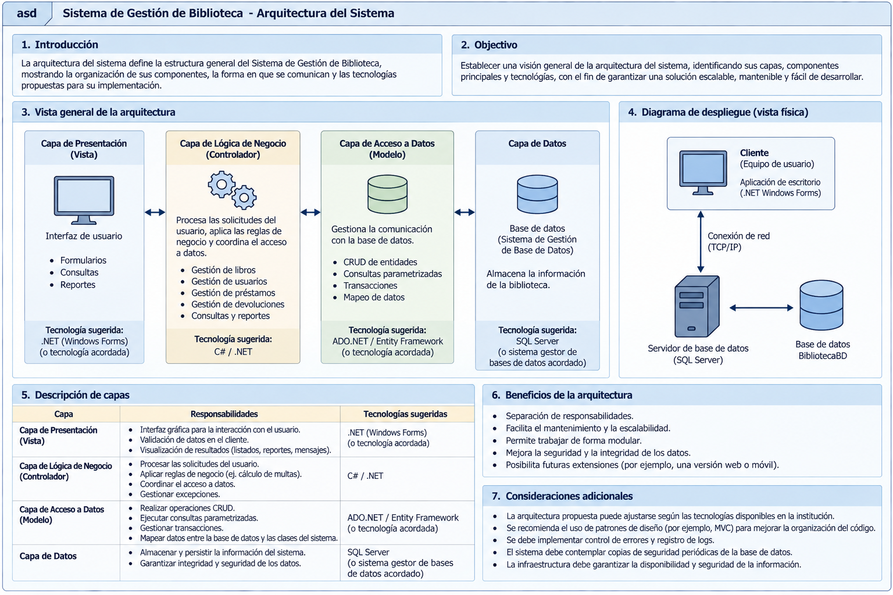

## 9.3 Capa de Presentación

**Responsabilidad:**

Es la capa mediante la cual el usuario interactúa con el sistema.

**Componentes:**

-   FrmPrincipal
-   FrmLibros
-   FrmAutores
-   FrmEditoriales
-   FrmUsuarios
-   FrmPrestamos
-   FrmReportes

**Tecnología utilizada:**

-   C#
-   Windows Forms
-   Visual Studio

## 9.4 Capa de Lógica de Negocio

**Responsabilidad:**

Procesa las solicitudes provenientes de la interfaz, aplica las reglas
de negocio y coordina las operaciones.

**Componentes:**

-   LibroController
-   AutorController
-   CategoriaController
-   UsuarioController
-   PrestamoController
-   DevolucionController

**Ejemplos de reglas:**

-   Validar disponibilidad.
-   Validar existencia del usuario.
-   Validar existencia del libro.
-   Calcular días de retraso.
-   Actualizar estados.


## Flujo de información

``` text
Usuario
   ↓
Presentación
   ↓
Lógica de Negocio
   ↓
Acceso a Datos
   ↓
SQL Server
```

Las respuestas de la base de datos realizan el recorrido inverso hasta
llegar nuevamente a la interfaz.

------------------------------------------------------------------------

# 10. EXPLICACIÓN DE CADA MÓDULO DESARROLLADO

## 10.1 Módulo de libros

**Objetivo:** Este módulo proporciona la interfaz gráfica necesaria para que
el administrador o bibliotecario gestione de manera integral el catálogo de 
obras de la biblioteca. Permite realizar el ciclo completo de mantenimiento de
datos (CRUD) sobre la entidad Libro, asegurando el control preciso del inventario
y la correcta categorización de los textos antes de ser procesados en el sistema 
de préstamos.

**Funcionalidades:** 1. *Consulta y Visualización de Catálogo:*
   * Cuenta con un componente de rejilla de datos (DataGridView) que despliega en tiempo real el listado completo de los libros registrados, detallando atributos clave como: ISBN, Título, IdAutor, IdEditorial, Categoría, Año y Existencias.

2. *Búsqueda Avanzada:*
   * Incorpora una barra de búsqueda indexada por el campo ISBN. Al ingresar el código único del libro y presionar el botón *"Buscar"*, el sistema filtra automáticamente el catálogo para agilizar la localización de ejemplares específicos.

3. *Operaciones de Mantenimiento (CRUD):*
   * *Nuevo / Guardar:* Habilita los campos del formulario para realizar el registro de un nuevo ejemplar en el sistema, validando la obligatoriedad de sus datos técnicos.
   * *Editar:* Permite la modificación de los atributos de un libro existente (como actualizar el título, corregir el año de publicación o reasignar su autor/editorial) seleccionándolo previamente desde la lista principal.
   * *Eliminar:* Remueve del catálogo activo el registro del libro seleccionado, restringiendo la acción si el ejemplar cuenta con dependencias activas o préstamos en curso.
   * *Cancelar:* Revierte cualquier acción en proceso, bloqueando nuevamente las cajas de texto y limpiando el formulario para prevenir modificaciones accidentales.
**Validaciones:**
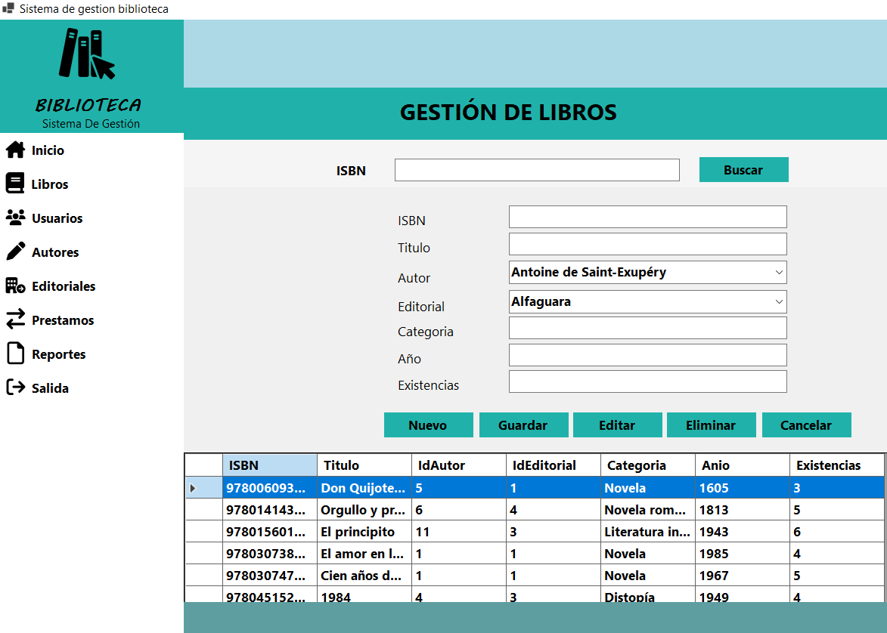
## 10.2 Módulo de autores

**Objetivo:** Este módulo proporciona la interfaz gráfica necesaria para que el administrador o bibliotecario
gestione de manera integral el catálogo de autores de la biblioteca. Permite realizar el ciclo
completo de mantenimiento de datos (CRUD) sobre la entidad Autor, asegurando el control preciso de sus identificadores y nombres antes de ser vinculados con sus respectivas obras en el sistema.

**Funcionalidades:** 1. *•Consulta y Visualización de Catálogo:•* 
   * Cuenta con un componente de rejilla de datos (DataGridView) que despliega de forma inmediata el listado de los autores con su ID, Nombre y Apellido.
2. *•Operaciones de Mantenimiento (CRUD):•*
   * *•Nuevo / Guardar:•* Habilita los campos del formulario para realizar el registro y almacenamiento permanente de un nuevo autor en la base de datos.
   * *•Editar:•* Permite la modificación de los atributos de un autor existente seleccionado en la tabla.
   * *•Eliminar:•* Remueve del catálogo activo el registro del autor seleccionado.
   * *•Cancelar:•* Revierte cualquier acción en proceso, bloqueando nuevamente los campos de captura y limpiando el formulario.
**Validaciones:**
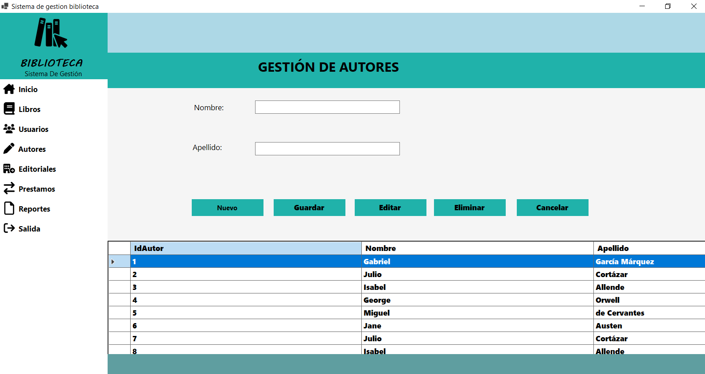


## 10.3 Módulo de usuarios

*•Objetivo:•* Este módulo proporciona la interfaz gráfica necesaria para que el administrador o bibliotecario gestione de manera integral el registro de los usuarios de la biblioteca. Permite realizar el ciclo completo de mantenimiento de datos (CRUD) sobre la entidad Usuario, asegurando el control preciso de sus datos personales y de contacto antes de habilitar transacciones como la asignación de préstamos en el sistema.

*•Funcionalidades:•* 
1. *•Consulta y Visualización de Catálogo:•* 
   * Cuenta con un componente de rejilla de datos (DataGridView) que despliega de forma inmediata el listado de los usuarios registrados mostrando su IdUsuario, Nombre, Apellido, Documento y Teléfono.
2. *•Operaciones de Mantenimiento (CRUD):•*
   * *•Nuevo / Guardar:•* Habilita los campos del formulario para realizar el registro y almacenamiento permanente de un nuevo usuario con sus datos esenciales (Nombre, Apellido, Documento, Teléfono y Correo) en la base de datos.
   * *•Editar:•* Permite la modificación de los atributos o datos de contacto de un usuario existente seleccionado en la tabla.
   * *•Eliminar:•* Remueve del catálogo activo el registro del usuario seleccionado.
   * *•Cancelar:•* Revierte cualquier acción en proceso, bloqueando nuevamente los campos de captura y limpiando el formulario.

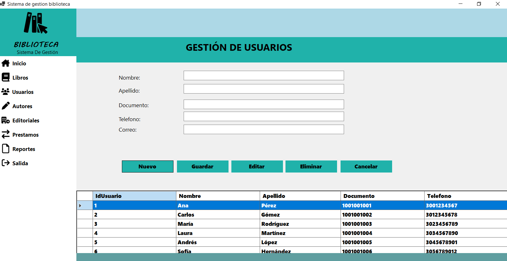

## 10.4 Módulo de editoriales

*•Objetivo:•* Este módulo proporciona la interfaz gráfica necesaria para que el administrador o bibliotecario gestione de manera integral el catálogo de las  editoras de la biblioteca. Permite realizar el ciclo completo de mantenimiento de datos (CRUD) sobre la entidad Editorial, asegurando el control y clasificación de los nombres de los sellos editoriales antes de asociarlos a las obras literarias en el sistema.

*•Funcionalidades:•* 
1. *•Consulta y Visualización de Catálogo:•* 
   * Cuenta con un componente de rejilla de datos (DataGridView) que despliega de forma inmediata el listado de las editoriales registradas mostrando su IdEditorial y Nombre.
2. *•Operaciones de Mantenimiento (CRUD):•*
   * *•Nuevo / Guardar:•* Habilita el campo del formulario para realizar el registro y almacenamiento permanente de una nueva casa editora (Nombre) en la base de datos.
   * *•Editar:•* Permite la modificación del nombre de una editorial existente seleccionada en la tabla.
   * *•Eliminar:•* Remueve del catálogo activo el registro de la editorial seleccionada.
   * *•Cancelar:•* Revierte cualquier acción en proceso, bloqueando nuevamente el campo de captura y limpiando el formulario.

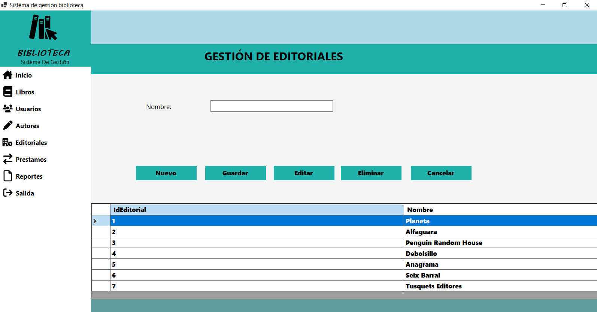

## 10.5 Módulo de préstamos

*•Objetivo:•* Este módulo proporciona la interfaz gráfica necesaria para que el administrador o bibliotecario gestione de manera integral las transacciones de salida y retorno de material bibliográfico. Permite realizar el ciclo completo de mantenimiento de datos (CRUD) sobre la entidad Préstamo, vinculando dinámicamente a los usuarios con los libros solicitados y controlando estrictamente los plazos y las fechas de devolución en el sistema.

*•Funcionalidades:•* 
1. *•Consulta y Visualización de Catálogo:•* 
   * Cuenta con un componente de rejilla de datos (DataGridView) que despliega de forma inmediata el historial y estado de las transacciones mostrando su IdPrestamo, IdUsuario, ISBN, FechaPrestamo y FechaDevolucion.
2. *•Operaciones de Mantenimiento (CRUD):•*
   * *•Nuevo / Guardar:•* Habilita los controles del formulario (selectores y componentes de fecha) para registrar un nuevo préstamo en la base de datos, asociando un usuario y un libro con sus respectivas fechas de salida y retorno sugerida.
   * *•Editar:•* Permite la modificación o actualización de las fechas y datos de una transacción de préstamo existente seleccionada en la tabla.
   * *•Eliminar:•* Remueve del historial activo el registro del préstamo seleccionado.
   * *•Cancelar:•* Revierte cualquier acción en proceso, bloqueando nuevamente los campos de captura y limpiando el formulario.

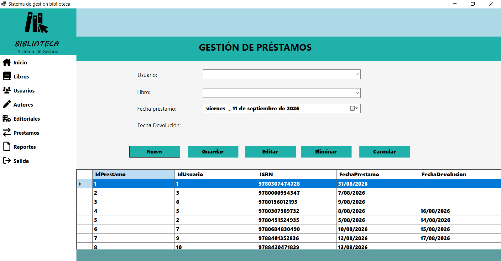

## 10.6 Módulo de Reportes

*•Objetivo:•* Este módulo proporciona la interfaz gráfica necesaria para que el administrador o bibliotecario genere informes detallados sobre los movimientos y el estado del inventario de la biblioteca. Permite la filtración y extracción de datos clave consolidados, facilitando la toma de decisiones y el seguimiento del flujo de libros y transacciones en el sistema.

*•Funcionalidades:•* 
1. *•Consulta y Visualización de Catálogo:•* 
   * Cuenta con un componente de rejilla de datos (DataGridView) que despliega los resultados de la consulta generada, mostrando información relevante como IdPrestamo, Usuario, ISBN, Título, FechaPrestamo y FechaDevolucion.
2. *•Operaciones de Control y Filtrado:•*
   * *•Selección de Tipo de Reporte:•* Incorpora un menú desplegable (ComboBox) que permite elegir el criterio de filtrado de los datos (por ejemplo, "Préstamos devueltos").
   * *•Generar Reporte:•* Procesa el filtro seleccionado y extrae de manera inmediata la información correspondiente desde la base de datos para mostrarla en la tabla.
   * *•Limpiar:•* Restablece el componente de selección y vacía la rejilla de datos, preparando la interfaz para una nueva consulta o reporte.

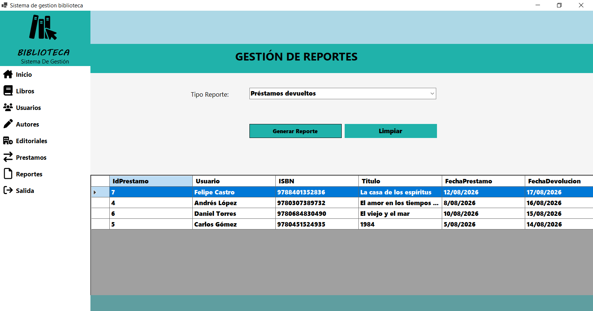


------------------------------------------------------------------------


# 13. CONCLUSIONES

## Conclusión 1
Se logró el desarrollo integral de la aplicación de escritorio utilizando la interfaz gráfica de Windows Forms en Visual Studio, cumpliendo con los requerimientos funcionales establecidos. El sistema optimiza la gestión de la información del proyecto y proporciona una experiencia de usuario intuitiva, segura y eficiente para la administración de los datos.


## Conclusión 2
El uso de una arquitectura por capas (como Presentación, Negocio y Datos) garantizó una separación clara de responsabilidades, lo que mejoró la escalabilidad del sistema. Asimismo, la integración con SQL Server a través de la capa de datos permitió un almacenamiento persistente, consultas eficientes y un manejo robusto de las transacciones, asegurando la integridad de la base de datos de la biblioteca.

## Conclusión 3
Durante el desarrollo se presentaron retos técnicos como la gestión de conexiones concurrentes a SQL Server y la validación de datos en tiempo real dentro de los formularios de Windows Forms. Estas dificultades se solucionaron implementando un correcto manejo de excepciones (bloques try-catch), el cierre adecuado de conexiones mediante bloques 'using', y centralizando las reglas de validación en la capa de negocio antes de interactuar con la base de datos.
Usa el código con precaución.

------------------------------------------------------------------------


# ANEXOS

## Anexo A. Repositorio GitHub

**Repositorio:** [Enlace al repositorio](https://github.com/itskely/swBiblioteca)

## Anexo B. Script de base de datos

**Archivo:** [scrip-biblioteca.sql](scrip-biblioteca.sql)


------------------------------------------------------------------------


