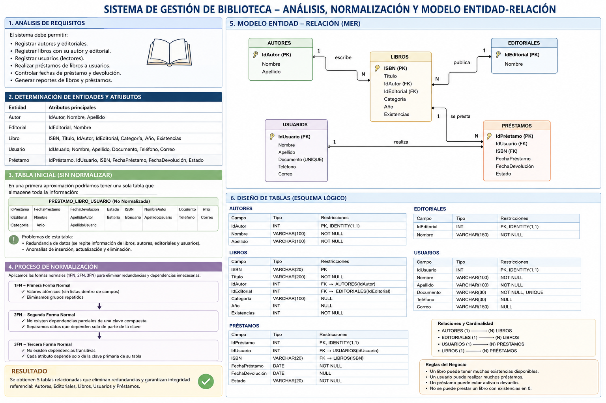

# SISTEMA DE GESTION DE BIBLIOTECA

## Portada

**Nombre del proyecto:** Sistema de gestion de Biblioteca(swBiblioteca)

**Docente:** Veronica Castro

**Integrante:** Kely Yohana Quilindo Hernandez

**Asignatura:** programacin avanzada

**codigo:** 53304

**Fecha:** Septiembre 2026

---

## Contraporda 

**Sistema de gestion de biblioteca**

**Institucion:** Corporación Unificada Nacional de Educación Superior CUN.

**Carrera:** Ingenieria de sistemas.

---

## 1.Introducción
El presente documento detalla el desarrollo de un Sistema de Gestión de Biblioteca
en formato de escritorio, diseñado para automatizar la administración de libros, 
estudiantes y el control de préstamos en una institución educativa. La solución se 
construyó utilizando el lenguaje C# y el motor de bases de datos SQL Server, 
aplicando los principios de la Programación Orientada a Objetos (POO).

A lo largo del informe se exponen el planteamiento del problema, los requerimientos del software, 
los diagramas demodelado (clases, casos de uso y entidad-relación), el diccionario de datos y la arquitectura 
técnica del sistema, ofreciendo una visión integral del proyecto desarrollado.

---

## 2.Objetivos

## Objetivo general

Desarrollar una aplicación de escritorio utilizando C# y SQL Server que permita
gestionar los procesos principales de una biblioteca mediante la aplicación de
Programación Orientada a Objetos y conexión a bases de datos.

## Objetivos específicos

Para el correcto desarrollo e implementacion del sistema,se plantean las siguientes metas tecnicas y operativas:
- Aplicar los principios de Programación Orientada a Objetos.
- Diseñar una base de datos relacional.
- Implementar operaciones CRUD.
- Utilizar SQL Server como gestor de base de datos.
- Implementar arquitectura por capas.
- Validar información ingresada por el usuario.
- Manejar excepciones.
- Utilizar Git y GitHub como sistema de control de versiones.
- Documentar técnicamente el proyecto. 

---
## 3.Planteamiento Del Problema

Una institución educativa desea automatizar el proceso de administración de su
biblioteca.
Actualmente toda la información relacionada con los libros, estudiantes,
préstamos y devoluciones se realiza manualmente, ocasionando pérdida de
información, errores en los registros y dificultad para consultar el estado de los
préstamos.
Para solucionar esta problemática se requiere desarrollar un sistema de escritorio
que permita administrar de forma organizada toda la información de la biblioteca.

___
## 4.Análisis De Requerimientos

RF01. Gestión de Libros

El sistema deberá permitir:
- Registrar libros.
- Consultar libros.
- Editar libros.
- Eliminar libros.
- Buscar libros por:
- Código
- Título
- Autor
- Categoría
- Mostrar disponibilidad del libro.

RF02. Gestión de Autores

El sistema deberá permitir:
Registrar autores.

Cada autor deberá almacenar:

- Código
- Nombre
- Apellidos
- Nacionalidad
- Fecha de nacimiento

RF03. Gestión de Categorías

Permitir administrar categorías como:
- Programación
- Bases de datos
- Redes
- Matemáticas
- Electrónica
- Inteligencia Artificial
- Otros

RF04. Gestión de Usuarios

Registrar los usuarios de la biblioteca.
Información mínima:
- Documento
- Nombre
- Apellidos
- Teléfono
- Correo electrónico
- Programa académico

RF05. Gestión de Préstamos

Permitir registrar préstamos.

Debe almacenar:
- Usuario
- Libro
- Fecha préstamo
- Fecha devolución esperada
- Estado

RF06. Gestión de Devoluciones

Registrar la devolución del libro.
Actualizar automáticamente:
- Disponibilidad
- Estado del préstamo

RF07. Consultas

Permitir consultar:
- Libros disponibles.
- Libros prestados.
- Usuarios con préstamos.
- Historial de préstamos.
- Cantidad de libros por categoría.
- Cantidad de libros prestados. 

---
## 4.Casos de uso

---
## 5.Diagrama de clases

---
## 6.Modelo entidad-relación

---
## 7.Diccionario de datos

---
## 8.Explicación de cada módulo

---

## 9.Conclusiones

---

